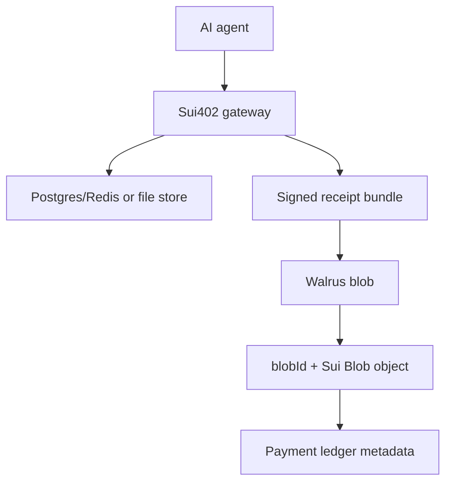

# Walrus Storage and Agent Memory

Walrus can be part of Sui402, but it should not replace the hot payment
database.

References:

- Walrus docs: https://docs.wal.app/
- Storing blobs: https://docs.wal.app/docs/walrus-client/storing-blobs
- Data security: https://docs.wal.app/docs/data-security

## Good Uses

- Public provider manifests and registry snapshots.
- Signed payment receipts and audit bundles.
- Agent memory snapshots that need verifiable availability.
- Tool execution logs for dispute resolution.
- Large model context artifacts, datasets, transcripts, and generated files.

## Bad Uses

- Challenge nonce storage.
- Replay protection.
- Rate limits.
- Operator sessions.
- Frequently mutated dashboard state.
- Private memory without encryption.

Walrus stores immutable public blobs. That is excellent for verifiable history
and agent memory artifacts, but it is not a low-latency mutable database.

## Recommended Architecture



Use the hot store for transactional correctness. Use Walrus for tamper-evident
artifacts that agents, merchants, auditors, and dispute flows can retrieve
later.

## Memory Model

Agent memory should be split into two layers:

- Working memory: short-lived, private, mutable state in a database or local
  encrypted store.
- Permanent memory: versioned snapshots stored as encrypted blobs on Walrus,
  referenced by `blobId`, content hash, owner, scope, and expiry.

Never store raw private user memory directly on Walrus. Encrypt first, then
store the encrypted blob. The Sui402 ledger should only keep references and
metadata needed to verify provenance.

## Product Path

1. Keep payment correctness in the console/gateway hot store.
2. Use `@sui402/walrus` to create content-addressed Sui402 artifact envelopes
   and publish/read them through Walrus HTTP publisher/aggregator endpoints.
3. Use the console API payment-ledger export endpoint to publish audit-log
   artifacts and persist returned blob IDs.
4. Use gateway/session receipt emission plus the console receipt export endpoint
   to publish signed receipt bundles.
5. Add encrypted agent memory snapshots once we have key management.
6. Add onchain references to important Walrus blobs only when settlement or
   disputes need Sui-level programmability.

## Package

`@sui402/walrus` currently supports:

- receipt bundle artifacts
- agent memory snapshot artifacts
- content hash validation
- artifact ID validation
- Walrus publisher upload via `PUT /v1/blobs`
- Walrus aggregator reads via `GET /v1/blobs/:blobId`

Example:

```ts
import { createReceiptBundleArtifact, publishWalrusArtifact } from "@sui402/walrus";

const artifact = createReceiptBundleArtifact({
  owner: merchantAddress,
  network: "sui:testnet",
  receipts: signedReceipts
});

const stored = await publishWalrusArtifact({
  publisherUrl: "https://publisher.walrus.example",
  artifact,
  epochs: 5
});

console.log(stored.blobId);
```
